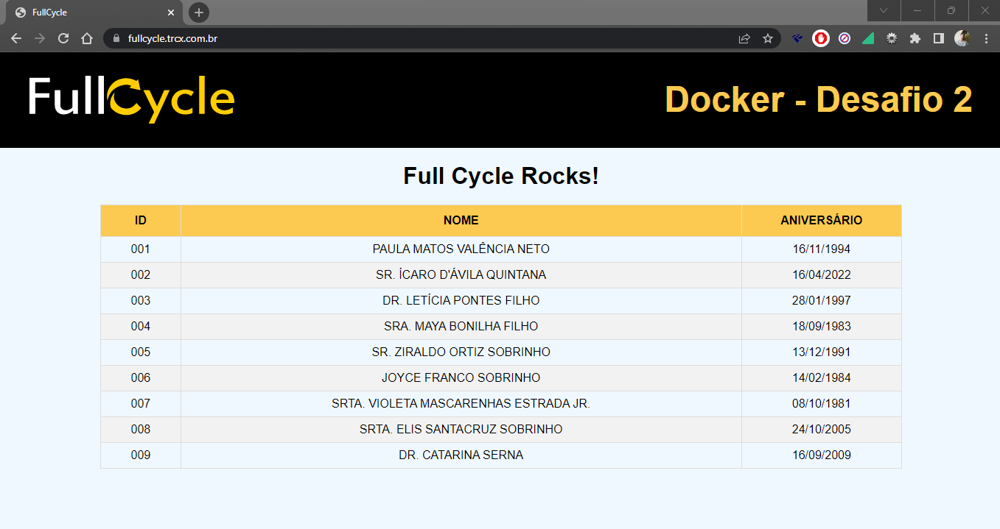

# Docker - Desafio 02:
================================================================================

## Detalhes

A Aplicação está online no seguinte endereço caso queira fazer testes: [TRCX](https://fullcycle.trcx.com.br)

### MySQL (DB)

- Banco de Dados: fullcycle

### Node Js (APP)
 
*http://localhost:3000*:

- Rota principal com o front

*http://localhost:3000/api/peoples*:

- Api para inclusão e retorno das pessoas cadastradas.

- Utilizei uma API para gerar pessoas aleatórias com as seguintes propriedades {name, birthDate}

- Para treinar alguns conceitos do docker, optei por desenvolver algo um pouco mais além do que o exercicio pedia, desta forma conseguir por em pratica grande parte do conteudo passado. Utilizei: typescript, typeorm e express.

- Por padrão é retornado apenas 10 registros mais recentes

### Nginx (SERVER)

- Proxy reverso 8080:80 -> 3000

